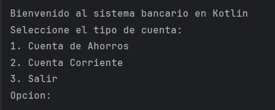
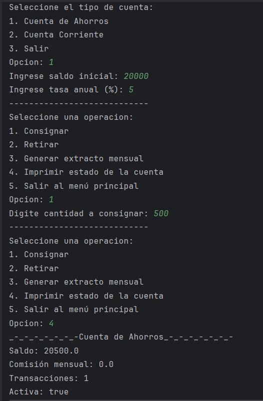
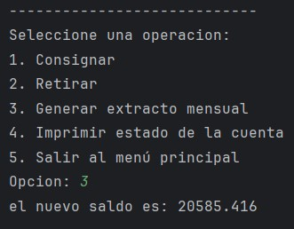
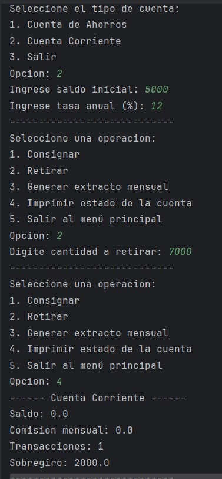
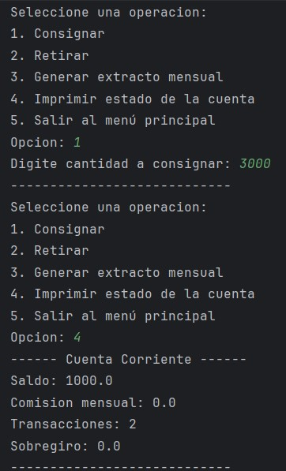
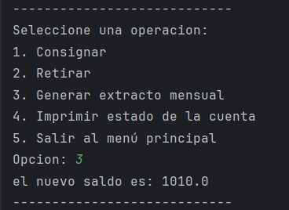

<div align="center">
  <h1>Sistema de Gestión Bancaria en Kotlin</h1>
</div>


---

###  Integrantes
* **Nombre:** Claudio Camilo Gonzales Mendieta
* **Código:** `22200020`
* **Nombre:** Jhair Roussell Melendez Blas
* **Código:** `22200199`

---

###  Descripción del Programa

Este repositorio contiene un programa que simula la gestión de cuentas bancarias, desarrollado en **Kotlin** para el curso de Desarrollo de Sistemas Móviles. El proyecto aplica los principios de la **Programación Orientada a Objetos** para modelar el comportamiento de diferentes tipos de cuentas.

El sistema se estructura en las siguientes clases:

* **`Cuenta` (Clase Padre):**
    * Define los atributos y métodos base para cualquier tipo de cuenta, como `saldo`, `tasaAnual`, y las operaciones de `consignar()`, `retirar()`, `extractoMensual()` e `imprimir()`.

* **`CuentaAhorros` (Clase Hija):**
    * Hereda de `Cuenta` y añade lógica específica:
    * La cuenta se considera **inactiva** si el saldo es inferior a $10,000. Si está inactiva, el menú de operaciones cambia dinámicamente para mostrar opciones limitadas, restringiendo depósitos y retiros.
    * Aplica una comisión adicional si se superan los 4 retiros mensuales.

* **`CuentaCorriente` (Clase Hija):**
    * Hereda de `Cuenta` y permite **sobregiros**. Si un retiro excede el saldo, la diferencia se cubre con un sobregiro que deberá ser pagado en futuras consignaciones.

#### Ejecución del Menú Interactivo:
El programa presenta un menú en la consola que se adapta según el estado de la cuenta de ahorros. Si el saldo baja de S/. 10,000, la cuenta se vuelve inactiva y algunas opciones se restringen, si es mayor a S/.10,000 se habilitan todas las funciones.


#### Pruebas de Funcionalidad

A continuación, se muestran algunas pruebas que demuestran el funcionamiento del programa:

* **Menú Principal y Selección de Cuenta:**
    Al iniciar, el programa despliega un menú principal donde el usuario puede seleccionar el tipo de cuenta que desea gestionar o salir del sistema.

    <div align="center">
  
    </div>

* **Creación y Operaciones en Cuenta de Ahorros:**
    Esta prueba muestra el flujo completo: creación de una cuenta con su saldo inicial y tasa anual, seguida de una consignación, la consulta del saldo actualizado y la generación del extracto mensual.

    <div align="center">
  
    </div>
    <div align="center">
  
    </div>

* **Prueba de Sobregiro en Cuenta Corriente:**
    Este ejemplo demuestra la capacidad de sobregiro. Se inicia con una cuenta de S/. 5,000 y se intenta retirar S/. 7,000, lo que resulta en un saldo de S/. 0 y un sobregiro de S/. 2,000. Luego, una consignación de S/. 3,000 paga el sobregiro y deja un saldo final de S/. 1,000. El extracto mensual posterior calcula los intereses sobre este nuevo saldo.

<div align="center">
  
</div>
<div align="center">
  
</div>
<div align="center">
  
</div>
  
###  Cómo se Usa

Para ejecutar este programa, necesitarás tener **IntelliJ IDEA** instalado en tu computadora.

1.  **Clonar el Repositorio**
    ```sh
    git clone https://github.com/CGM-23/Trabajo_moviles2.git
    ```

2.  **Abrir en IntelliJ IDEA**
    * Abre el programa y selecciona `File > Open...` y elige la carpeta del proyecto que acabas de clonar.

###  Tecnología Utilizada
* **Lenguaje:** Kotlin
* **Entorno de Desarrollo:** IntelliJ IDEA Community Edition
